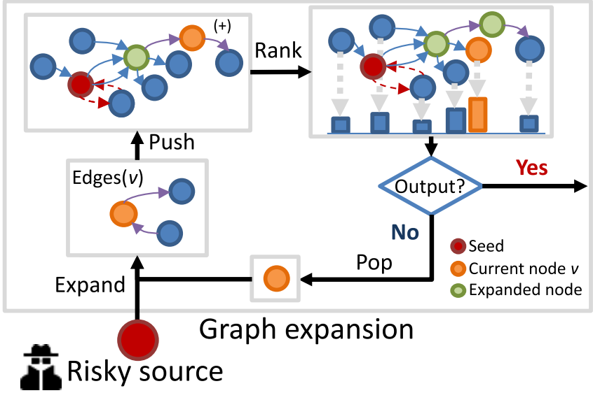

# Graph-based Transaction tracing

The transaction subgraph spiders aim at collecting the transactions (or token transfers) related to the specific source
addresses.
BlockchainSpider provides the following strategies for sampling:

- **BlockchainSpider.strategies.txs.BFS**: Breath-First Search.
- **BlockchainSpider.strategies.txs.Poison**: A kind of taint analysis technology.
- **BlockchainSpider.strategies.txs.Haircut**: A kind of taint analysis technology.
- **BlockchainSpider.strategies.txs.APPR**: the Approximate Personalized PageRank algorithm.
- **BlockchainSpider.strategies.txs.TTRRedirect**: the Transaction Tracing Rank algorithm.

The performance comparison of the above strategies is as follows:


All transaction subgraph spiders are implemented based on the framework graph expansion,
which has four core operations:

- **Expand**: collects all transactions related to a given address.
- **Push**: merges the collected transactions to the subgraph.
- **Rank**: computes the relevance of addresses in the subgraph to the source address.
- **Pop**: select an address for expanding.



The implementation of different strategies are as follows:

| Strategy | Push & Rank                                                                 | Pop & Expand                                                      |
|----------|-----------------------------------------------------------------------------|-------------------------------------------------------------------|
| BFS      | Add expanded neighbors to a queue                                           | Select a unexpanded node in the header of the queue for expanding |
| Poison   | Add expanded out-degree neighbors to a queue                                | Select a unexpanded node in the header of the queue for expanding |
| Haircut  | Allocated the pollution value to the neighbors according to the edge weight | Select a unexpanded node with the highest pollution for expanding |
| APPR     | Use the local push procedure for extended neighbors                         | Select a node with the highest residual for expanding             |
| TTR      | Use the TTR local push procedure for extended neighbors                     | Select a node with the highest residual for expanding             |

💡 For more details, please refer to the paper: [TRacer: Scalable Graph-Based Transaction Tracing for Account-Based Blockchain Trading Systems](https://ieeexplore.ieee.org/abstract/document/10098630).

## Customise your own strategy
You can implement your own strategy by inheriting the `BlockchainSpider.strategies.txs.PushPopModel` class.
Here's the simplest example, in which for each Ethereum address, we track only the output money transfer with the largest Ether value.

**First**, we create a new file `mystg.py` in the root directory of the project and declare a PushPopModel class:
```python
from typing import Any, Dict, Tuple
from BlockchainSpider.strategies.txs import PushPopModel

class MyStrategy(PushPopModel):
    def __init__(self, source, **kwargs):
        super().__init__(source, **kwargs)
        self.to_be_vis = set()

    def push(self, node, edges: list, **kwargs):
        # node is the address of the current node
        # edges is a list of money transfers related to the current address
        # each edge is a dict with fields as TransferItem, e.g., `AccountTransferItem`,
        # please refer to the fields at `BlockchainSpider/items/subgraph.py`
        edges = [edge for edge in edges if edge['address_from'] == node]
        if len(edges) == 0:
            return 
        edges.sort(key=lambda x: int(x['value']), reverse=True)
        self.to_be_vis.add(edges[0]['address_to']) 

    def pop(self) -> Tuple[Any, Dict]:
        if len(self.to_be_vis) == 0:
            return None, {}
        node = self.to_be_vis.pop()
        
        # the returned dictionary will be used as the kwargs for the next push
        # we don't need to pass the context, so we return the empty dictionary
        return node, {}

    def get_context_snapshot(self) -> Dict:
        return {'to be visited': self.to_be_vis}

    def get_node_rank(self) -> Dict:
        return {}
```

**Next**, you can start the `txs.blockscan` spider and mount the new strategy:
```shell
scrapy crawl txs.blockscan \ 
-a source=0xYourSourceAddress \
-a apikeys=YourApiKey1,YourApiKey2 \
-a strategy=mystg.MyStrategy
```